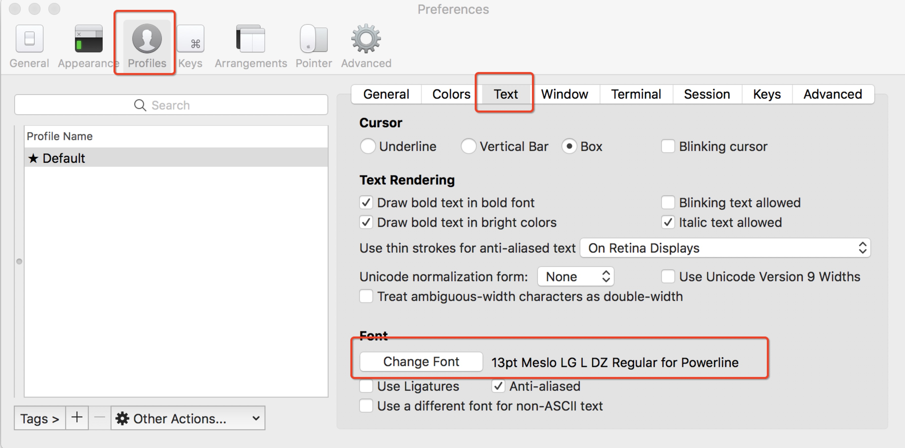

# iTerm2 的安装配置


## 配置

### 安装 Powerline

官网：http://powerline.readthedocs.io/en/latest/installation.html

首先安装 pip （已安装则忽略）

```bash
sudo easy_install pip
```

使用 pip 安装 powerline

```bash
pip install powerline-status
```

### 下载并安装字体库

```bash
git clone https://github.com/powerline/fonts.git --depth=1
cd fonts && ./install.sh
```

### 设置iTerm 2的字体

打开iTerm2  > 偏好设置 > Profiles > Text > Font 设置为 13pt Meslo LG L DZ Regular for Power Line



### 配色方案

配色方案大全：http://iterm2colorschemes.com

使用自定义配色方案：https://github.com/czewail/iterm2-theme